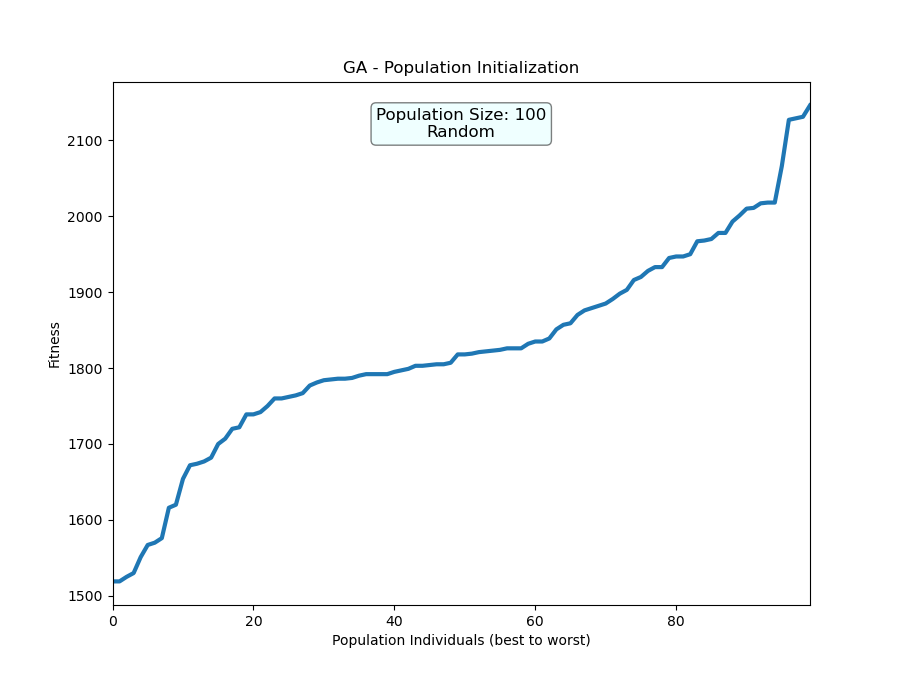
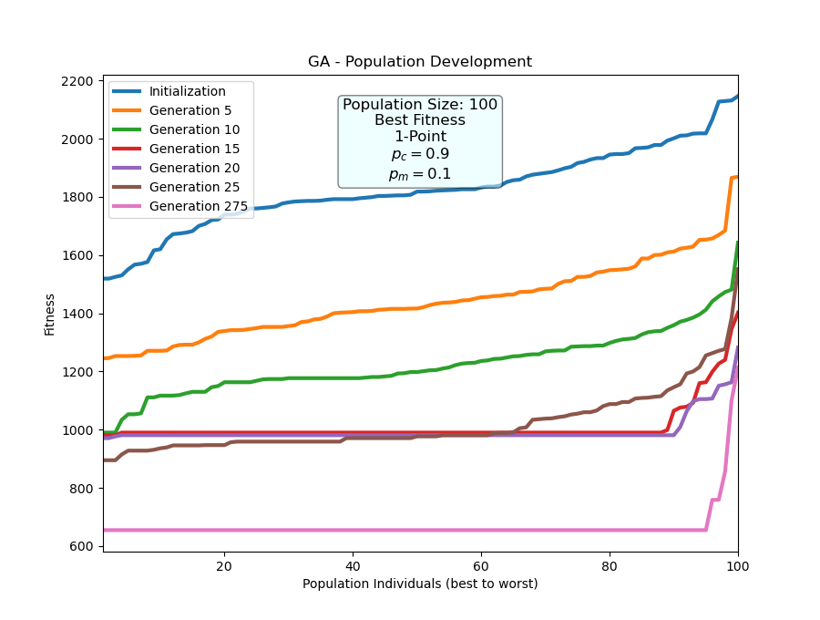
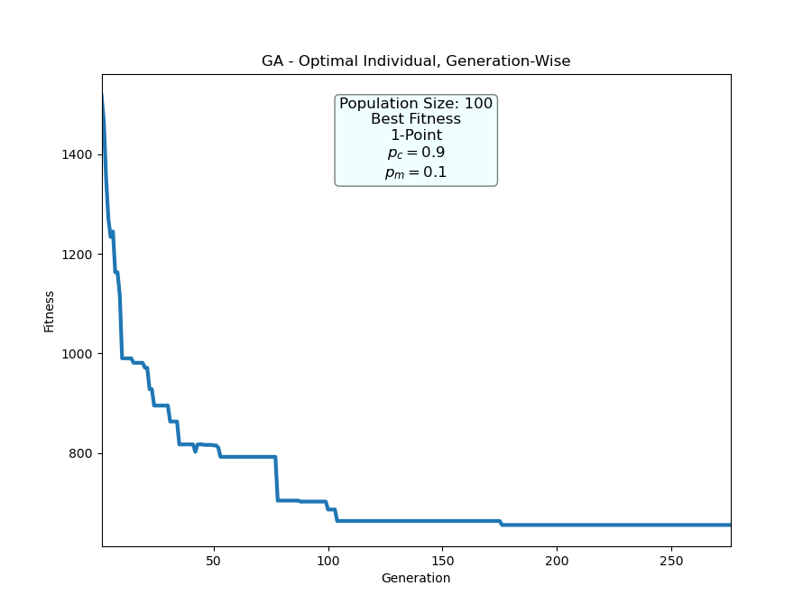
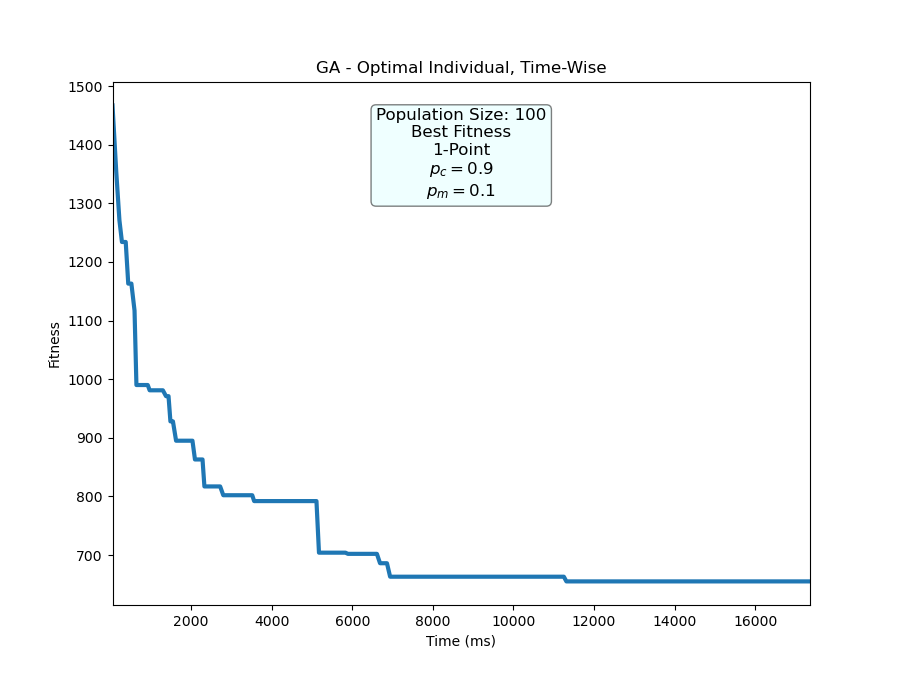
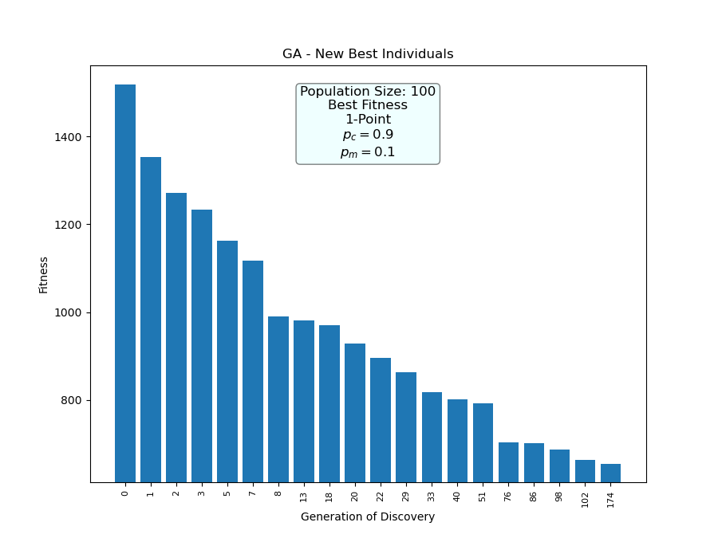
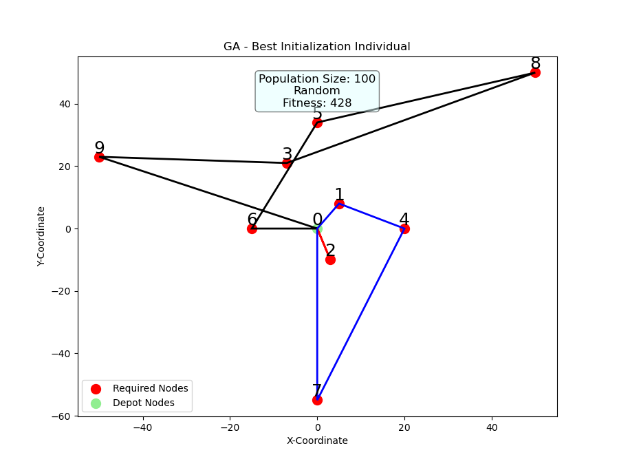
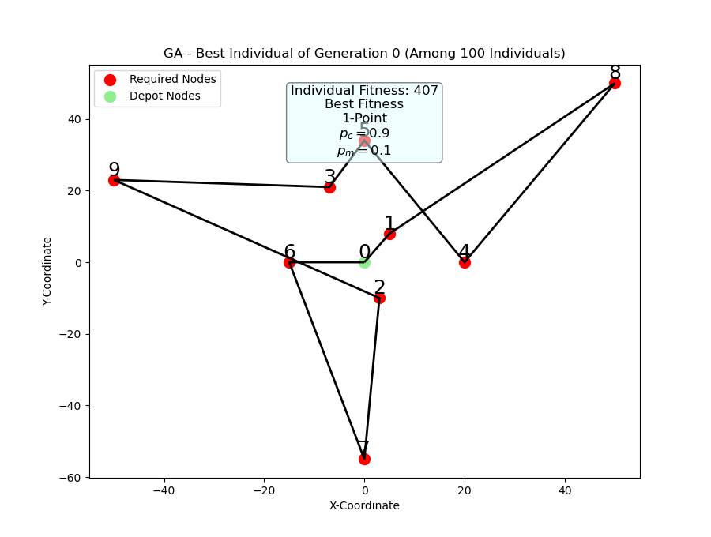
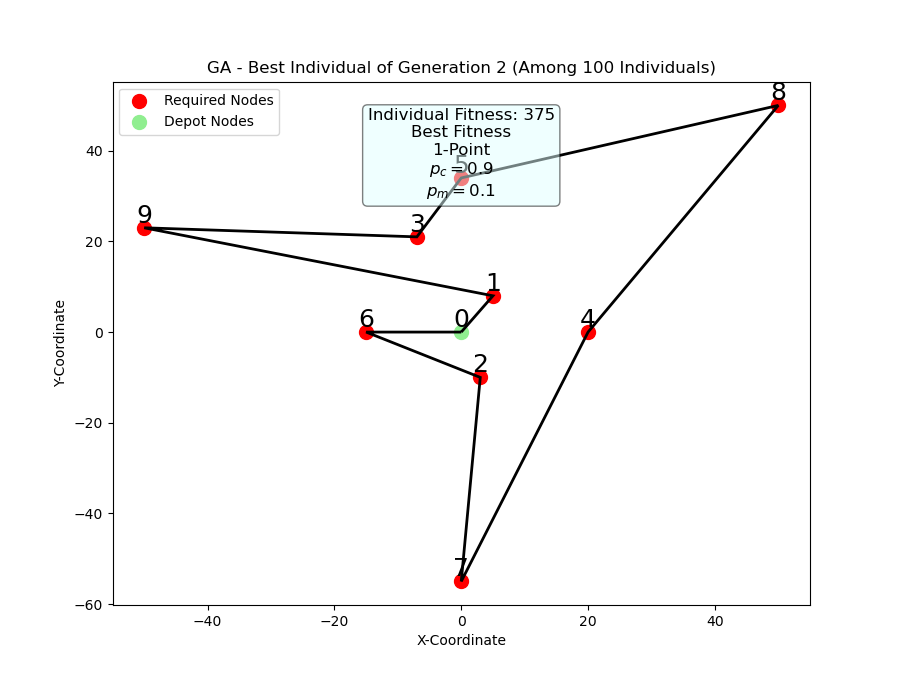
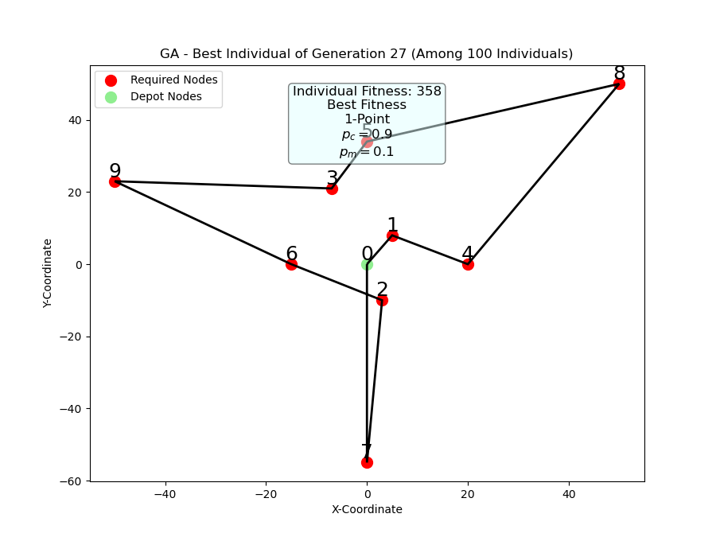
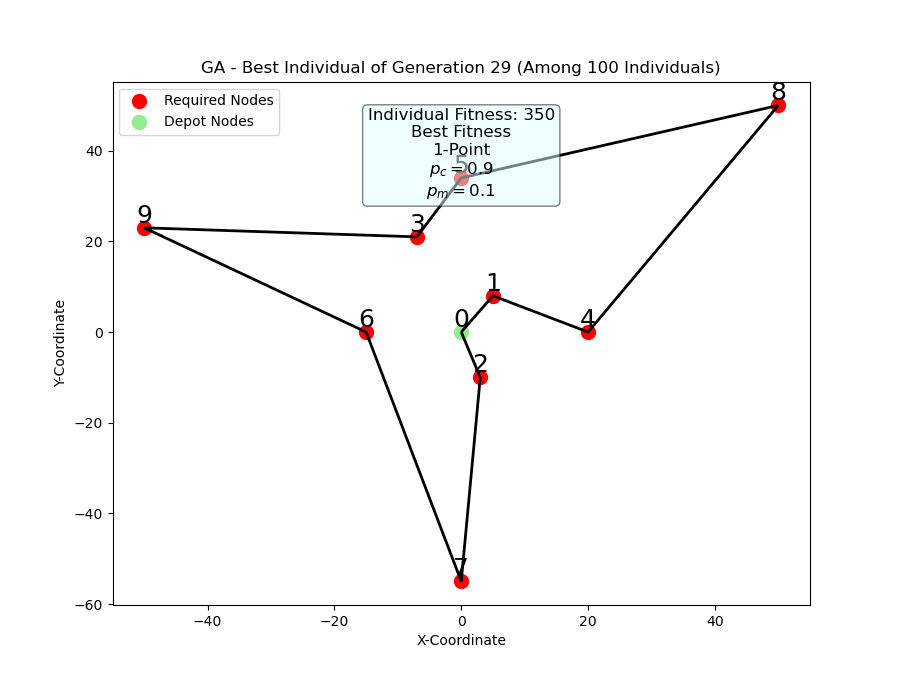

# vrp-gen-alg - Instructions

Here are brief instructions on how to use this application.

## Table of Contents

- [Project Acquisition](#project-acquisition)
- [Startup](#startup)
- [Inputs](#inputs)
- [Running the GA](#running-the-ga)
- [Viewing Results](#viewing-results)
- [Interpreting Data](#interpreting-data)
- [Building and Loading Matrices](#building-and-loading-matrices)
- [Building and Loading Parameters](#building-and-loading-parameters)
- [Creating Maps](#creating-maps)
- [Noteworthy Mentions](#noteworthy-mentions)

### Project Acquisition

Either clone the project:

```
git clone https://github.com/terratenff/vrp-gen-alg.git
```

Or download its ZIP-file and unpack it.

### Startup

Navigate to the inside of the project and launch the main file.

```
cd vrp-gen-alg
python main.py
```

Make sure that you have the necessary libraries set up in the environment you are using. These can be found in the text file "requirements.txt".

You'll be presented with the following menu upon a successful startup:

```
--- Vehicle Routing Problem with Genetic Algorithm ---
------- Selected Data List --------
Distance Matrix: | sample
Coordinates:     | None
Demands:         | None
Penalties:       | None
Profits:         | None
Service Times:   | None
Time Windows:    | None
-----------------------------------
0 - RUN | 1 - Generate Data | 2 - Select Data | 3 - Deselect Data | 4 - View Data | 5 - Set Params (VRP) | 6 - Set Params (GENALG) | 7 - Save Params | 8 - Load Params | 9 - View Params | -1 - Exit
>
```

### Inputs

Most of the navigation in the application is done by giving integers between 0 and 9. Other forms of input are used when requested.

### Running the GA

Start GA using menu option 0. The application starts up with default settings. These define the problem instance as a simple VRP with no constraints, except for maximum of 3 vehicles. Subject cost matrix is called "sample.txt" (note that the menu omits the suffix ".txt"). Run the GA by inputting 0. Initialization procedure begins. It starts by determining which VRP extensions are used and what other details are considered. It should look like the following:

```
Using CVRP:  False
Using OVRP:  False
Using VRPP:  False
Using MDVRP: False
Using VRPTW: False
Maximize Objective:   False
Exclude Travel Costs: False
Optimize Depot Nodes: False
Hard Windows:         False
```

Having initialized, the GA now proceeds to initialize the population. Using the random population initialization function, it lets us know of the completion of generation 0 population with something like this:

```
(Random) Population initialization OK (Time taken: 93.75 ms)
```

Now that generation 0 population had been created, it has entered the primary loop. You can observe its progress by viewing its output. Here's what 10 generations might look like:

```
Generation     1 /  1500 (Min:     0 /   100) | Best Fitness (Generation / Overall): 1467 / 1467
Generation     2 /  1500 (Min:     0 /   100) | Best Fitness (Generation / Overall): 1353 / 1353
Generation     3 /  1500 (Min:     0 /   100) | Best Fitness (Generation / Overall): 1271 / 1271
Generation     4 /  1500 (Min:     0 /   100) | Best Fitness (Generation / Overall): 1234 / 1234
Generation     5 /  1500 (Min:     1 /   100) | Best Fitness (Generation / Overall): 1245 / 1234
Generation     6 /  1500 (Min:     0 /   100) | Best Fitness (Generation / Overall): 1163 / 1163
Generation     7 /  1500 (Min:     1 /   100) | Best Fitness (Generation / Overall): 1163 / 1163
Generation     8 /  1500 (Min:     0 /   100) | Best Fitness (Generation / Overall): 1117 / 1117
Generation     9 /  1500 (Min:     0 /   100) | Best Fitness (Generation / Overall): 990 / 990
Generation    10 /  1500 (Min:     1 /   100) | Best Fitness (Generation / Overall): 990 / 990
```

What is seen here is, starting from the left,
- Current generation
- Maximum generation count
- Current generation with respect to minimum generation count
- Minimum generation count
- Fitness of the best individual of current generation
- Fitness of the best individual overall

The counter for the minimum generation count is reset every time a new best overall individual is discovered.

Once GA has finished due to any termination criteria, it'll let you know of it:

```
Algorithm has finished. (Time taken: 17359.375 ms)
```

### Viewing Results

Upon termination of the GA, you are presented with the best individual overall that it has come across. An example of this is as follows:

```
Discovered an individual with the following details:
-------------------------------------------------
Individual ID: 33330
- Solution: [0, 26, 29, 14, 17, 28, 21, 19, 6, 1, 3, 8, 5, 4, 13, 7, 22, 24, 20, 9, 12, 16, 18, 15, 2, 25, 27, 11, 23, 10, 30, 0, 0]
  - Route 1: [0, 26, 29, 14, 17, 28, 21, 19, 6, 1, 3, 8, 5, 4, 13, 7, 22, 24, 20, 9, 12, 16, 18, 15, 2, 25, 27, 11, 23, 10, 30]
- Fitness: 655.00
- Valid: True
```

Immediately after this it proceeds to create figures for you to observe:

```
Preparing data for drawing plots...
Drawing plots...
(Once a window appears, closing it resumes execution.)
```

A tkinter-based window should popup. Next/Previous buttons can be used to navigate between figures. Below is shown what these figures entail.



Figure that demonstrates population initialization contains the distribution of generation 0 individuals, sorted by ascending fitness values. If the problem instance was that of VRPP, individuals would have been sorted in descending order instead.



Figure about population development shows how populations (sorted by fitness in ascending/descending order) have developed over the generations in terms of individuals' fitness values. By default, generations 0, 5, 10, 15, 20, 25 and the last generation are drawn, but if total number of generations was 35 or less, generations between 5 and 25 are replaced with generation 1, 2, 3, 4 and 5.



Generation-wise optimal individuals show the best fitness-valued individuals that was discovered in their generations.



Time-wise optimal individuals illustrates the development of the best overall individual over time.



This bar graph aims to show which generations discovered a new best overall individual. If there are too many of these, a fixed number of them are selected in a linear manner, such that generation 0 and last generation are included.

If, with or without a cost matrix, coordinates are included in the problem instance, maps are drawn as well. See [Creating Maps](#creating-maps) for more about drawing maps.

### Interpreting Data

Along with figures, data used to draw them are saved as well. They are located in the subfolder "plot_data", situated in the folder "variables".

For each time the GA is run, a folder containing everything collected is created. These contain folders "R-1", "R-2" etc. Each of them include details of the results and the results themselves. Details look something like this:

```
Plot Title: GA - Population Initialization
X-axis:     Population Individuals (best to worst)
Y-axis:     Fitness
```

The results are n x 2 matrices where n varies: it could be population size or various amounts of generations. The first column of the matrix is the collection of values on the x-axis, while the second column is that of y-axis. They are limited to 8 decimals. If multiple lines were drawn, their data are separated in different results text files as "results_1.txt", "results_2.txt" etc.

### Building and Loading Matrices

With the matrix builder it is possible to create randomly generated matrices quite easily; nonetheless, it is only limited to randomly generated matrices. If there are specific elements that you want in the matrices you have to add them yourself. If coordinates are generated, you have the option to generate a cost matrix to go with it.

Generating matrices (menu option 1) won't select them for use automatically. You have to select (load) them for use separately (menu option 2). Matrices can also be deselected (menu option 3) if necessary.

### Building and Loading Parameters

Parameter building is quite simple. Select either VRP-related parameters (menu option 5) or GA-related options (menu option 6), and then follow the instructions. Most matrices can also be selected for use here: the exceptions to this are the cost matrix and coordinates.

Once parameters have been selected, they can be saved for later use (menu option 7). To use them later, load parameters by providing the name you used to save them with (menu option 8).

Before starting GA again, you can view specific matrices (menu option 4) and do one final check on everything that has been set so far (menu option 9).

### Creating Maps

In order to create maps, coordinates must be specified. You can define them yourself (as long as it forms an n x 2 matrix) or create a randomly generated set as instructed in [Building and Loading Matrices](#building-and-loading-matrices). Then you have the option to use overriding matrices. It acts as the cost matrix for given set of coordinates. In order to use a cost matrix like that, its size must match the number of coordinate pairs. If an overriding matrix is not used, an undefined matrix is used: this is a cost matrix that contains distances amongst the coordinates and satisfies the triangle inequality.

The following extra figures are maps that are to be expected if a problem instance includes coordinates.



Map of the best individual of generation 0 is expected to look messy - unless Simulated Annealing is used with lots of iterations (300 000 or more, for example).

Different colors of the lines separate different vehicle routes from one another.









Multiple maps (10 or less) are generated purely for illustration purposes. They make the interpretation of individuals' solutions somewhat easier.

### Noteworthy Mentions

If GA has trouble creating individuals for the population, there are some measures that could be considered. For example:
- Are the constraints too strict? If so, see if you could loosen them.
- If constraints cannot be loosened, try using different combinations of parameters. High vehicle count might help.
- Are there any issues with parameters/matrices that are being used?
- Setting the number of available vehicles low could result in GA being unable to find valid solutions. Check if it is possible to find a solution with more of them.
- How are the conversion factors set? Should both time and distance translate to cost?
- It is known (as of 17.2.2021) that the application does not solve large cases efficiently - especially if they have strict constraints.
- Parameters that indicate the maximum time and distance for vehicles are effectively hard time windows: if they are broken, the solution in question is replaced. This can hinder the application's ability to find a solution that respects these constraints. A way to combat this is to replace them with soft time windows, aimed at depot nodes, and then give depots extremely high penalty coefficients to simulate hard time windows.

Be careful while handling the GUI. It is known to crash the application if it is very actively interacted with (notable example of this is resizing - especially with many figures contained within it).
